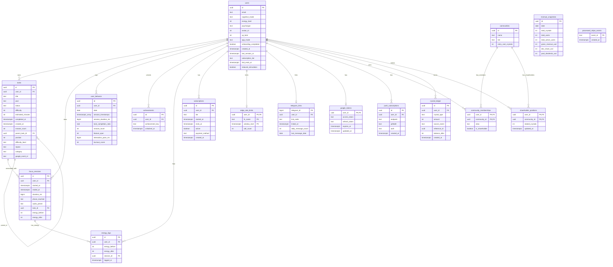

# Sprint 2 Audit: Database & Backend Edge Functions

This audit reviews database migrations (001-024), Row-Level Security (RLS) policies, Edge Function implementations, and webhook logic.

## Executive Summary & Score

* **Sprint Confidence Score**: **77 / 100** (Target: ≥85)
* **Status**: **CRITICAL RISK** (Blocked by missing expected tables `daily_tasks` and `usage_limits` in migrations)

---

## Severity Matrix

| Item | Severity | Evidence | Fix Estimate |
|:---|:---|:---|:---|
| **Missing Expected Tables** | **CRITICAL** | `daily_tasks` and `usage_limits` do not exist in any migration file. | 2-3 hours (needs schema design + sync) |
| **Undocumented Database Setup Step** | **MEDIUM** | Setting GUC `app.cron_secret` for `telegram-agent-update` is only in SQL comments in `024_security_hardening.sql`. | 10 mins (add to README) |
| **Circuit Breaker Fail-Closed Rate Limiter** | **LOW** | Rate limiting circuit breaker fails CLOSED after 5 DB failures, which might block user calls if DB is down. | 30 mins |

---

## Detailed Findings

### 1. Database Migrations (CRITICAL GAP)
An audit of `supabase/migrations/` was conducted. There are **24 migration files** (from `001_init.sql` to `024_security_hardening.sql`) which run sequentially:
* **Expected vs Actual**: The migrations successfully cover features up to the crystal economy, communities, and security hardening. However, **there are no definitions for tables named `daily_tasks` or `usage_limits`**. 
  * `daily_tasks` with columns `actual_minutes` and `last_started_at` is completely missing from the schema.
  * `usage_limits` is referenced in architectural documentation (`docs/adr/0001-db-backed-rate-limiting.md`) as "existing table... used for action type limits", but it does not exist in any database migration.
  * *Note*: The frontend codebase does not reference `daily_tasks` or `usage_limits` in code imports, meaning this is a documentation/requirements drift where the feature was either refactored or never fully ported to migrations.

* **Migration 004 (Edge Rate Limits)**: The implementation of public function `increment_rate_limit` in [004_edge_rate_limits.sql](file:///c:/Projects/mindshift/supabase/migrations/004_edge_rate_limits.sql) is highly robust and atomic. It uses an `INSERT ... ON CONFLICT (user_id, fn_name, window_start) DO UPDATE SET call_count = call_count + 1` statement. This ensures correctness and atomicity across concurrent Deno isolates.

### 2. Mermaid ER Diagram of Deployed Tables
The following diagram represents the actual tables created by the 24 sequential migrations:

### 3. Edge Functions Audit (EXCELLENT)
The four requested Edge Functions were audited:
* **decompose-task**:
  * **JWT Validation**: Enforced via `config.toml` (`verify_jwt = true`) and explicitly validated in code: `await supabase.auth.getUser()`. Returning 401 on unauthorized credentials.
  * **Rate Limiting**: Enforced via `checkDbRateLimit`. Free limits: **20 calls/hour** (windowMs: 3,600,000). Pro users bypass rate limits.
  * **Error Handling**: Implements try/catch blocks. Structured logging logs errors server-side via `console.error('[decompose-task]', msg)`.
  * **Input Validation**: Length limits enforced (title < 500 chars, description < 1000 chars) with size validations.
* **recovery-message**:
  * **JWT Validation**: Enforced via `verify_jwt = true` and `auth.getUser()`.
  * **Rate Limiting**: Free limits: **5 calls/day** (windowMs: 86,400,000).
  * **Error Handling**: Generates safe fallback messages (e.g. *"Welcome back — you showed up, and that's what matters. Let's start with just one small thing."*) on any error, protecting the user experience.
* **weekly-insight**:
  * **JWT Validation**: Enforced.
  * **Rate Limiting**: Free limits: **3 calls/day** (windowMs: 86,400,000).
  * **Data Bounds**: Capped at 500 sessions in input validation to prevent memory exhaustion.
* **dodo-webhook**:
  * **JWT Validation**: Correctly disabled (`verify_jwt = false` in `config.toml`) because it receives calls directly from Dodo Payments.
  * **Signature Check**: Employs standard HMAC-SHA256 verification using Web Crypto API. Includes a 5-minute replay window check.
  * **Idempotency**: Uses the `processed_stripe_events` table (repurposed for any webhook event UUID) to prevent processing the same payment twice.
  * **Lifecycle updates**: Correctly handles events to update `users.subscription_tier` (free/pro/pro_trial) based on subscription status.

* **TOCTOU in Double-Gate Rate Limiting**: Confirmed **NO TOCTOU vulnerability** exists. The client-side checks are merely a performance gate. The server-side Edge Function executes an atomic database transaction (`increment_rate_limit`) which locks the rate limit window in Postgres before letting requests proceed.

### 4. Row-Level Security (RLS) policies (EXCELLENT)
* RLS is enabled on all tables.
* Policies correctly restrict writes/reads to `auth.uid() = user_id` or `auth.uid() = id`.
* Admin tables like `processed_stripe_events` have RLS enabled with zero policies, restricting access exclusively to the service-role key used by webhooks (correct practice).

---

## Action Plan to Reach Score 100
1. **Clarify missing tables**: Design or resolve where `daily_tasks` and `usage_limits` schemas are defined, and append their creation migrations to the sequence.
2. **Document cron setup**: Add database environment execution notes in `HANDOVER_PACKAGE.md` for running `ALTER DATABASE postgres SET "app.cron_secret" = '<CRON_SECRET_VALUE>'` so the background agent cron in `023` works out-of-the-box.
